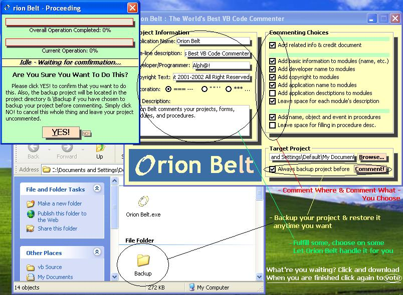



## \_\_\_ Orion Belt \- The World's BEST VB Code Commenter\!\! Comments projects modules procedures CHECK IT\!

### Description

Orion Belt is an excellent VB-Code commenter, even I'm not sure is it the world's best or not :P ... It AUTOMATICALLY scan and search every ASCII of your projects, forms, modules, and even procedures, to gather some useful information and use them to comment your projects. Comes with many commenting features and an attracting interface. Can backup the project before commenting if you like. Take a glance at the screenshot! Anyway, picture tells only a thousand words while experiencing does millions. Download! Vote! Thanks!!!
 
### More Info
 

             |
---                |---
**Submitted On**   |2001-12-08 23:35:32
**By**             |[Alph@\!](https://github.com/Planet-Source-Code/PSCIndex/blob/master/ByAuthor/alph.md)
**Level**          |Advanced
**User Rating**    |3.7 (55 globes from 15 users)
**Compatibility**  |VB 5\.0, VB 6\.0
**Category**       |[Complete Applications](https://github.com/Planet-Source-Code/PSCIndex/blob/master/ByCategory/complete-applications__1-27.md)
**World**          |[Visual Basic](https://github.com/Planet-Source-Code/PSCIndex/blob/master/ByWorld/visual-basic.md)
**Archive File**   |[\_\_\_\_Orion\_403371282001\.zip](https://github.com/Planet-Source-Code/alph-orion-belt-the-world-s-best-vb-code-commenter-comments-projects-modules-procedures-ch__1-29587/archive/master.zip)

### API Declarations

Click below (or above?) to download! Go on! Go on! Only CopyFile API used in the backup things! Download! VOTE!!!

